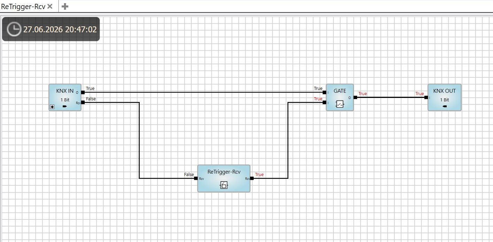
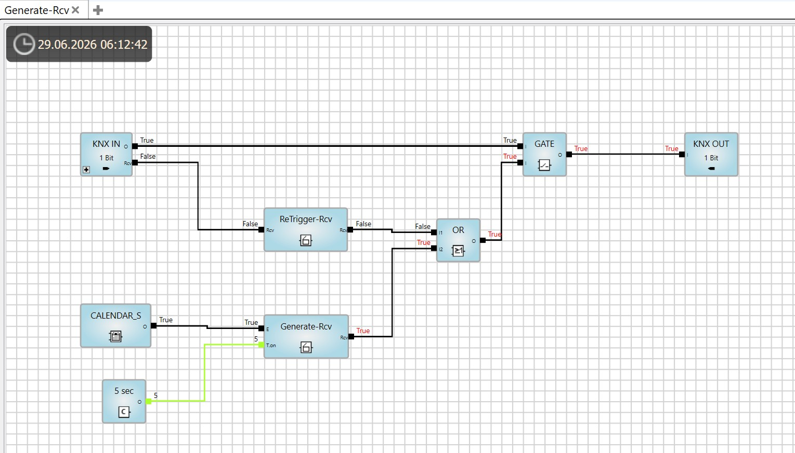
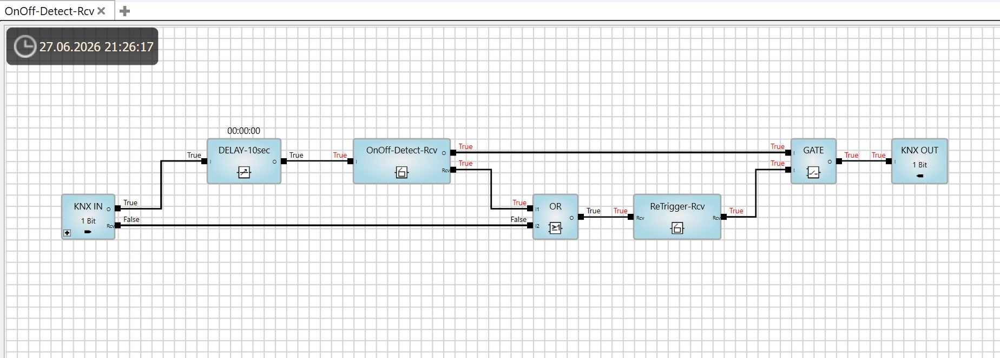
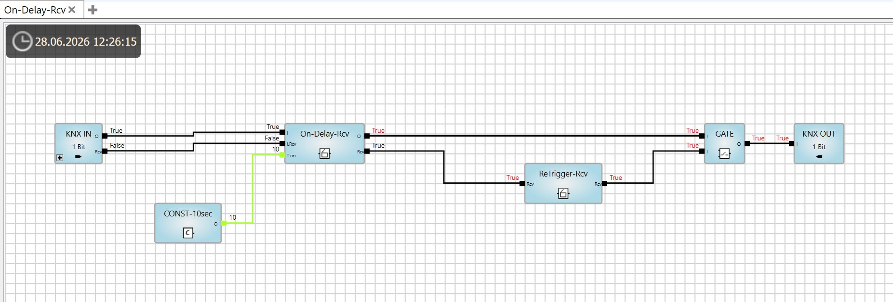
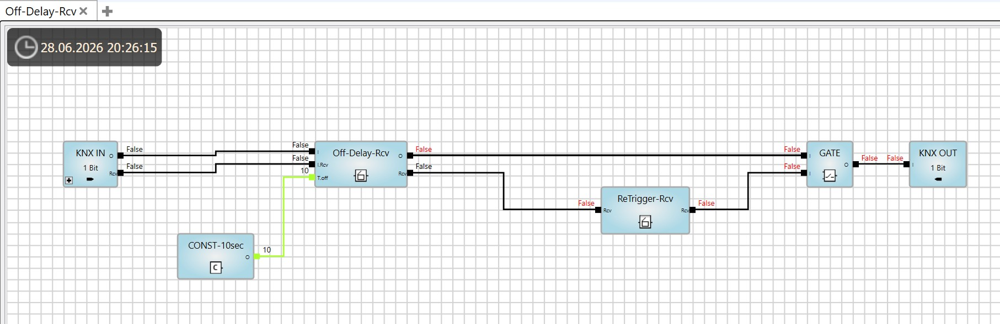
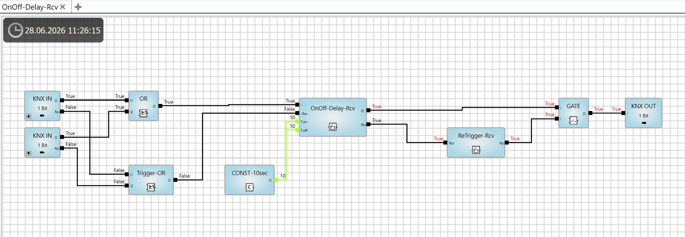
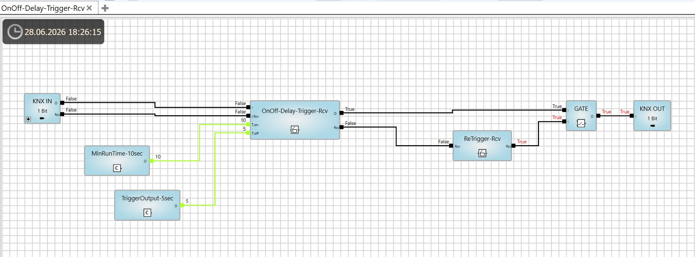
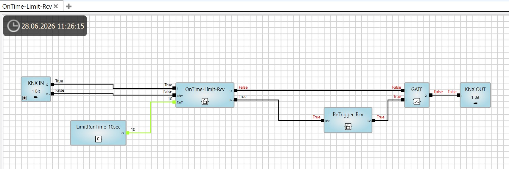
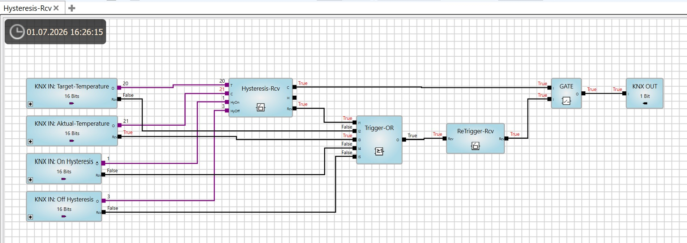

# ABB ABA/S1.2.1 KNX Logic Block Library (Rcv-Series)

A collection of rock-solid, fully tested, and optimized custom function blocks for the **ABB ABA/S1.2.1 Logic Controller**. 

This library introduces a standardized **Rcv (Receive/Receiver)** pulse-logic architecture. It filters out signal noise, prevents deadlocks, and simplifies complex timing, hysteresis, and automation tasks in KNX installations.

## 🚀 Key Benefits
* **Immense Time Savings:** Skip the hours of building, troubleshooting, and testing custom feedback loops in the Graphical Logic Editor.
* **Pulse-Driven Reliability:** Every block includes a `Rcv` interface to guarantee deterministic behavior across the KNX bus.
* **Tested & Proven:** Fully simulated and optimized for real-world automated building control.

---

## 🧠 Why the `Rcv` Architecture is Critical for ABB ABA/S1.2.1

In the ABB Graphical Logic Editor, standard logic blocks do not automatically force a recalculation or bus transmission upon every internal state change. To guarantee that outputs are reliably transmitted to the KNX bus, you must use **ABB Gate Blocks**. These Gates have a unique property: **they strictly require a Control Pulse (`Rcv`) to force a recalculation and refresh the output.**

However, real-world execution inside the ABA/S1.2.1 controller introduces two major challenges that this library solves:

1. **The Timing Race Condition:** If a complex calculation takes a few milliseconds too long, the original `Rcv` pulse arriving from the KNX bus completes *before* the new output value is ready. As a result, the Gate does not update correctly, and the telegram is swallowed. 
   * *The Solution:* **`ReTrigger-Rcv`** should be placed at every single Output Gate. It automatically "pushes" a second delayed pulse behind the calculation, ensuring the Gate accurately catches and broadcasts the final value.
2. **The Passive Gate Problem:** Gates remain completely passive unless triggered. If a status is missed or needs cyclical verification, the logic stalls.
   * *The Solution:* **`Generate-Rcv`** acts as a heartbeat/watchdog (e.g., every 10 minutes) to cyclically re-trigger all subsequent output Gates, forcing a periodic system-wide state refresh.

**Every function block in this library natively outputs a `Rcv` pulse on state changes to cascade this enforcement down to all subsequent Gates in your logic chain.**

---

## 📦 Included Function Blocks

### 🗂️ Quick Index (Table of Contents)

| 🔹 Pulse Blocks (Impuls) | 🔹 Timer Blocks (Timer) | 🔹 Temperature Control (Temperatur) |
| :--- | :--- | :--- |
| 1. [ReTrigger-Rcv](#1-retrigger-rcv) | 4. [On-Delay-Rcv](#4-on-delay-rcv) | 9. [Hysteresis-Rcv](#9-hysteresis-rcv) |
| 2. [Generate-Rcv](#2-generate-rcv) | 5. [Off-Delay-Rcv](#5-off-delay-rcv) | |
| 3. [OnOff-Detect-Rcv](#3-onoff-detect-rcv) | 6. [OnOff-Delay-Rcv](#6-onoff-delay-rcv) | |
| | 7. [OnOff-Delay-Trigger-Rcv](#7-onoff-delay-trigger-rcv) | |
| | 8. [OnTime-Limit-Rcv](#8-ontime-limit-rcv) | |

---

### 🔹 Pulse Blocks (Impuls)

#### 1. ReTrigger-Rcv
The core architectural block of this library. An incoming Rcv pulse is required to evaluate the input state. It is designed to be placed at every Output Gate to eliminate timing race conditions where the original KNX bus pulse arrives too early for slow internal logic calculations.
* **Standard Mode:** Forwards the incoming input pulse directly to the output to trigger the Gate immediately.
* **Safety/Delayed Pulse ([ReTriggerDelay-Rcv](fb/ReTriggerDelay-Rcv.fbxml) Variant):** Automatically pushes a second 1-second pulse after the specified delay time. This guarantees that even if a complex calculation takes a few milliseconds longer, the final value is safely captured and forced onto the KNX bus.
  * **IN:** `Rcv [Bit]`, `Delay [sec]`
  * **OUT:** `Rcv [Bit]`
  * **Downloads:**
    * 📄 Download ABA Function Block File: [ReTrigger-Rcv.fbxml](fb/ReTrigger-Rcv.fbxml)
    * ⚙️ Download ABA Example File: [ReTrigger-Rcv.xml](example/ReTrigger-Rcv.xml)

---

#### 2. Generate-Rcv
Generates a periodic 1-second Rcv pulse at the output as long as the Enable input is HIGH. Useful for watchdog functions.
* **Example:** Specifying **3600** for *Delay Time* will generate a Rcv pulse **every hour**.
* **Technical Note / Tip:** To ensure the generator starts automatically after a system boot, connect the Enable input to the output of a Calendar block output. If the Enable input is permanently wired to static HIGH, the generator will not auto-start after a reboot without external interaction.
  * **IN:** `Enable [Bit]`, `Delay Time [sec] (Internally multiplied by 2)`
  * **OUT:** `Rcv [Bit]`
  * **Downloads:**
    * 📄 Download ABA Function Block File: [Generate-Rcv.fbxml](fb/Generate-Rcv.fbxml)
    * ⚙️ Download ABA Example File: [Generate-Rcv.xml](example/Generate-Rcv.xml)

---

#### 3. OnOff-Detect-Rcv
Forward the input signal changes to the output and additionally generate a Rcv pulse. Perfectly suited for triggering subsequent gates on any state transition.
  * **IN:** `I [Bit] (signal)`
  * **OUT:** `O [Bit] (signal)`, `Rcv [Bit] (pulse)`
  * **Downloads:**
    * 📄 Download ABA Function Block File: [OnOff-Detect-Rcv.fbxml](fb/OnOff-Detect-Rcv.fbxml)
    * ⚙️ Download ABA Example File: [OnOff-Detect-Rcv.xml](example/OnOff-Detect-Rcv.xml)

---

### 🔹 Timer Blocks (Timer)

#### 4. On-Delay-Rcv
Standard ON-delay. An incoming Rcv pulse is required to evaluate the input state. The output switches to HIGH only if the input remains HIGH for the specified On-Delay time. A LOW state at the input switches the output to LOW immediately.
  * **IN:** `I [Bit] (signal)`, `Rcv [Bit] (pulse)`, `On-Delay [sec]`
  * **OUT:** `O [Bit] (signal)`, `Rcv [Bit] (pulse)`
  * **Downloads:**
    * 📄 Download ABA Function Block File: [On-Delay-Rcv.fbxml](fb/On-Delay-Rcv.fbxml)
    * ⚙️ Download ABA Example File: [On-Delay-Rcv.xml](example/On-Delay-Rcv.xml)

---

#### 5. Off-Delay-Rcv
Standard OFF-delay. An incoming Rcv pulse is required to evaluate the input state. A HIGH state at the input switches the output to HIGH immediately. The output switches back to LOW only if the input remains LOW for the specified Off-Delay time.
  * **IN:** `I [Bit] (signal)`, `Rcv [Bit] (pulse)`, `Off-Delay [sec]`
  * **OUT:** `O [Bit] (signal)`, `Rcv [Bit] (pulse)`
  * **Downloads:**
    * 📄 Download ABA Function Block File: [Off-Delay-Rcv.fbxml](fb/Off-Delay-Rcv.fbxml)
    * ⚙️ Download ABA Example File: [Off-Delay-Rcv.xml](example/Off-Delay-Rcv.xml)

---

#### 6. OnOff-Delay-Rcv
Standard interlocked ON/OFF delay. An incoming Rcv pulse is required to evaluate the input state. The output switches to HIGH only after the input remains HIGH for the specified On-Delay time. To switch it back to LOW, the input must remain LOW for the specified Off-Delay time. Short signal fluctuations at the input are filtered out and do not affect the output.
  * **IN:** `I [Bit] (signal)`, `Rcv [Bit] (pulse)`, `On-Delay [sec]`, `Off-Delay [sec]`
  * **OUT:** `O [Bit] (signal)`, `Rcv [Bit] (pulse)`
  * **Downloads:**
    * 📄 Download ABA Function Block File: [OnOff-Delay-Rcv.fbxml](fb/OnOff-Delay-Rcv.fbxml)
    * ⚙️ Download ABA Example File: [OnOff-Delay-Rcv.xml](example/OnOff-Delay-Rcv.xml)

---

#### 7. OnOff-Delay-Trigger-Rcv
An incoming Rcv pulse is required to evaluate the input state. If the input remains ON for the specified On-Delay time and then turns OFF, the output switches ON for the specified Off-Delay time.
  * **IN:** `I [Bit] (signal)`, `Rcv [Bit] (pulse)`, `On-Delay [sec]`, `Off-Delay [sec]`
  * **OUT:** `O [Bit] (signal)`, `Rcv [Bit] (pulse)`
  * **Downloads:**
    * 📄 Download ABA Function Block File: [OnOff-Delay-Trigger-Rcv.fbxml](fb/OnOff-Delay-Trigger-Rcv.fbxml)
    * ⚙️ Download ABA Example File: [OnOff-Delay-Trigger-Rcv.xml](example/OnOff-Delay-Trigger-Rcv.xml)

---

#### 8. OnTime-Limit-Rcv
Limits the HIGH state of the output to the specified timeout period. An incoming Rcv pulse is required to evaluate the input state. After the timeout expires, the output switches to LOW even if the input remains HIGH. Forwards incoming Rcv pulses from the input to the output, and generates an additional Rcv pulse whenever the output state changes.
  * **IN:** `I [Bit] (signal)`, `Rcv [Bit] (pulse)`, `Timeout [sec]`
  * **OUT:** `O [Bit] (signal)`, `Rcv [Bit] (pulse)`
  * **Downloads:**
    * 📄 Download ABA Function Block File: [OnTime-Limit-Rcv.fbxml](fb/OnTime-Limit-Rcv.fbxml)
    * ⚙️ Download ABA Example File: [OnTime-Limit-Rcv.xml](example/OnTime-Limit-Rcv.xml)

---

### 🔹 Temperature Control (Temperatur)

#### 9. Hysteresis-Rcv
Controls the system using an absolute switch-on point and a relative switch-off point based on the hysteresis values. Provides both direct (Cooling) and inverted (Heating) outputs.

* **Cooling Output (ON) / Heating Output (OFF):** Current Temperature ≥ Target + On Hysteresis
* **Cooling Output (OFF) / Heating Output (ON):** Current Temperature < Target + On Hysteresis - Off Hysteresis
* **Generates a Rcv pulse** whenever either output state changes.

### 📝 Hysteresis Example:
* **Target:** 20°C | **On Hysteresis:** 1K *(Threshold: 21°C)* | **Off Hysteresis:** 3K *(Threshold: 18°C)*

**Cooling Output behavior:**
* ≥ 21°C → **Cooling ON**
* 20°C to 19°C → **Cooling no change** *(Keeps previous state)*
* ≤ 18°C → **Cooling OFF**

**Heating Output behavior:**
* ≤ 18°C → **Heating ON**
* 19°C to 20°C → **Heating no change** *(Keeps previous state)*
* ≥ 21°C → **Heating OFF**

* **IN:** `Target Temperature [16 Bit]`, `Current Temperature [16 Bit]`, `On Hysteresis [16 Bit] (Kelvin)`, `Off Hysteresis [16 Bit] (Kelvin)`
* **OUT:** `Cooling [Bit] (signal)`, `Heating [Bit] (signal)`, `Rcv [Bit] (pulse)`
* **Downloads:**

    * 📄 Download ABA Function Block File: [Hysteresis-Rcv.fbxml](fb/Hysteresis-Rcv.fbxml)
    * ⚙️ Download ABA Example File: [Hysteresis-Rcv.xml](example/Hysteresis-Rcv.xml)

